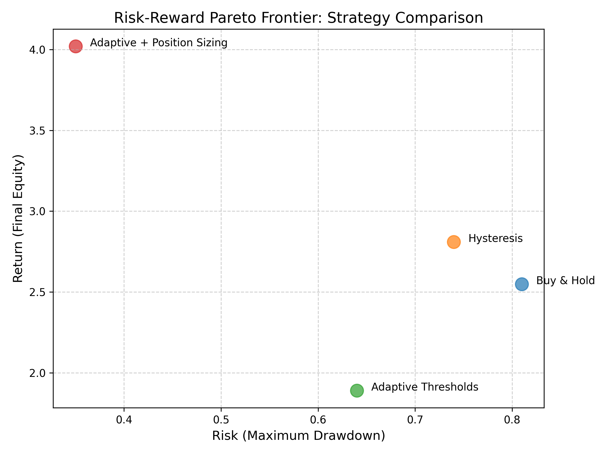

# ETH Walk-Forward Execution & Risk Allocation

This project studies execution-layer design for machine-learning-based directional signals under non-stationary crypto markets.

We evaluate multiple execution strategies on ETH 4H data (2019–2026) using leakage-free walk-forward validation and cost-aware backtesting.

## Key takeaway
Execution-layer risk budgeting (adaptive thresholds + position sizing) dominates static execution and buy-and-hold on a risk–return Pareto basis.

## Methodology
- Asset: ETH/USDT (OKX)
- Frequency: 4H
- Validation: Expanding walk-forward (strict OOS)
- Signal: Tree-based classifier (probability output)
- Execution:
  - Static hysteresis
  - Adaptive thresholds
  - Adaptive thresholds + regime-based position sizing
- Costs: 10 bps per turnover

## Results (Out-of-Sample)

### Equity Comparison (Strategy vs Buy & Hold)

### Risk–Return Pareto Frontier

## Repo structure
- `notebooks/` — main end-to-end notebook
- `figures/` — result images used in README

## Disclaimer
Research/educational only. Not financial advice.
